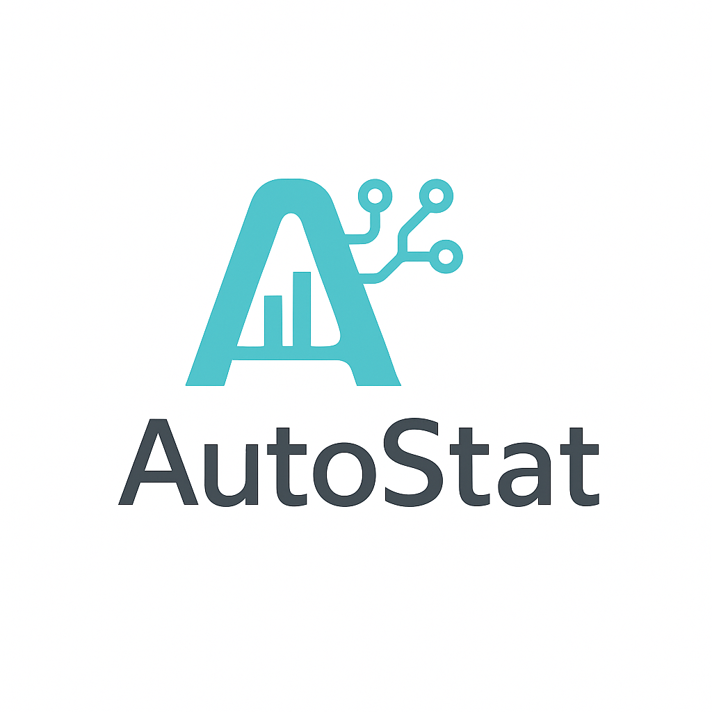

# AutoStat

<div align="center">
  
</div>


**AutoStat** is an R package that uses Large Language Models (LLMs) to assist with statistical analysis workflows. It generates analysis plans, R code, and reports based on your data and research questions.

## Features

- **Multi-Provider Support**: Compatible with Anthropic (Claude), OpenAI (GPT), and Google (Gemini) models
- **Automated Analysis**: Generates R code for statistical analysis from natural language questions
- **Two-Step Approach**: Develops an analysis plan, then produces executable code
- **Visualizations**: Creates plots based on your research questions
- **Reports**: Generates HTML reports with interpretations, visualizations, and code
- **Error Handling**: Includes error detection and resolution for generated code
- **Web Interface**: Interactive Shiny application available at [zhangxianyang.shinyapps.io/AutoStat](https://zhangxianyang.shinyapps.io/AutoStat/)

## Installation

```r
# Install from GitHub (requires devtools)
if (!requireNamespace("devtools", quietly = TRUE)) {
  install.packages("devtools")
}
devtools::install_github("zhangxiany-tamu/AutoStat")
```

## Requirements

- R version 3.6.0 or higher
- An API key from one of the supported LLM providers
- Required R packages are installed automatically

## Basic Usage

```r
library(AutoStat)

# Analyze your data
results <- auto_stat(
  data = mtcars,
  question = "What factors are most strongly associated with fuel efficiency (mpg)?",
  api_key = "your_api_key",
  llm_provider = "anthropic",
  llm_model = "claude-sonnet-4-5-20250929"
)

# View the generated report
browseURL(results$report_path)
```

## What AutoStat Returns

The `auto_stat()` function returns a list containing:

- `plan`: The analysis plan generated by the LLM
- `code_response`: The full LLM response with executable code
- `extracted_code`: Clean R code ready for execution
- `results`: Analysis results including statistical outputs and plots
- `interpretation`: LLM's interpretation of the results
- `report_path`: Path to the generated HTML report
- `output_dir`: Directory where outputs were saved

## Examples

### Basic Analysis
```r
# Simple correlation analysis
results <- auto_stat(
  data = iris,
  question = "What is the relationship between petal length and sepal length?",
  api_key = "your_api_key",
  llm_provider = "gemini"
)
```

### Advanced Parameters
```r
# Customize LLM parameters
results <- auto_stat(
  data = airquality,
  question = "How do weather conditions affect ozone levels?",
  api_key = "your_api_key",
  llm_provider = "anthropic",
  llm_model = "claude-sonnet-4-5-20250929",
  llm_generation_params = list(temperature = 0.1, max_tokens = 3000),
  max_rows = 100  # Include more data in prompts for larger datasets
)
```

## Supported Providers

| Provider | Example Model | API Key Source |
|----------|---------------|----------------|
| Anthropic | `claude-sonnet-4-5-20250929` | [Console](https://console.anthropic.com/) |
| OpenAI | `gpt-5` | [Platform](https://platform.openai.com/) |
| Google | `gemini-2.5-flash` | [AI Studio](https://ai.google.dev/) |

### Latest Models (2025)

**Anthropic Claude Models:**
- `claude-sonnet-4-5-20250929` - Best for complex analysis and coding tasks
- `claude-haiku-4-5-20251001` - Fast, cost-effective option
- `claude-opus-4-1-20250805` - Most capable for complex reasoning

**OpenAI Models:**
- `gpt-5` - Latest flagship model with advanced reasoning
- `gpt-5-mini` - Balanced performance and cost
- `gpt-5-nano` - Fast and economical
- `gpt-4o` - Still available, previous generation

**Google Gemini Models:**
- `gemini-2.5-pro` - Most advanced with 1M token context
- `gemini-2.5-flash` - Fast with excellent performance
- `gemini-2.5-flash-lite` - Most cost-efficient option

## Common Use Cases

- **Exploratory Data Analysis**: Quick insights into dataset patterns
- **Data Visualization**: Context-aware plot generation
- **Report Generation**: Professional analysis reports with minimal effort

## Troubleshooting

**API Key Issues**: Ensure your API key is valid and has sufficient credits/quota.

**Package Dependencies**: If you encounter missing package errors, install them manually:
```r
install.packages(c("ggplot2", "dplyr", "broom", "knitr"))
```

**Large Datasets**: For datasets with >50 rows or >20 columns, consider setting `include_full_data = FALSE` to avoid token limits.

## Contributing

Contributions are welcome! Please feel free to submit issues or pull requests.

## License

MIT License
